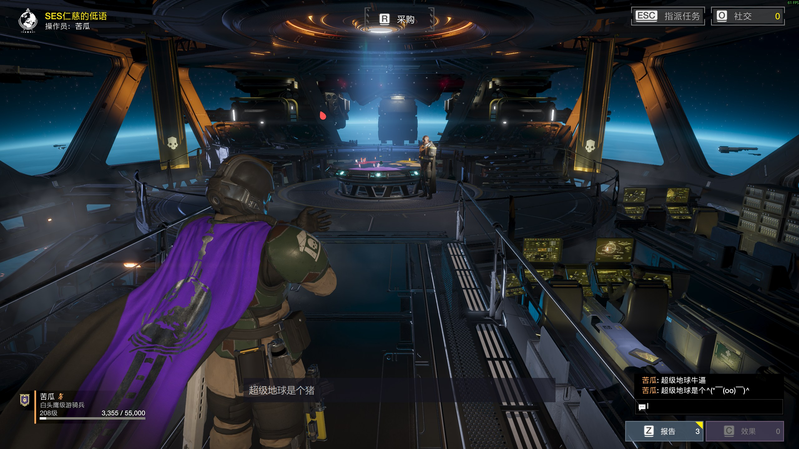

# 超级猪头在 自由如寂： 7.1.0  版本修复了中文输入的问题，这个项目已经不需要了
# HD2 “ 超级”中文输入工具（hd2-chinese-input.exe）

绝地潜兵 2（HELLDIVERS 2）游戏内**中文聊天输入工具**：无可见输入框——按游戏聊天键（Enter）直接呼出，用**系统中文输入法**组字（IME 候选窗浮在画面上），迷你浮层实时显示已上屏文本，Enter 发送。



## 超级特性
- 点开即用、无控制台黑窗（系统托盘常驻，右键退出）
- **Enter 直呼出、零延迟**；Enter 发送 / Esc 取消 / F8 手动切换；Alt-Tab 切走自动静默退出
- 游戏关闭后约 5 秒自动退出（不残留）
- 可经 **Steam 启动选项**随游戏自动拉起（双进程：关闭工具不影响游戏）
- 纯 Win32、零第三方依赖；不注入、不读内存、不改游戏文件

## 超级用法

### 1）直接双击
运行 `hd2-chinese-input.exe` → 托盘出现图标。进游戏按 Enter 即可打字。

### 2）Steam 启动选项随游戏自动启动（推荐）
库 → HELLDIVERS 2 → 属性 → 通用 → **启动选项**：
```
"存放路径\hd2-chinese-input.exe" --spawn %command%
```
点"开始游戏"：工具自动启动并拉起游戏；游戏退出后工具自动结束。**单独关闭工具不影响游戏**。
若原本的启动参数有如 --use-d3dx11 应追加在最后面，如下：
```
"存放路径\hd2-chinese-input.exe" --spawn %command% --use-d3dx11
```

### 3）任务计划自动拉起（可选，不改 Steam）
`launcher.bat` 由任务计划每分钟检查一次：游戏在跑且工具没在跑 → 拉起工具。注册：
```
schtasks /Create /F /TN "HD2-CN-Input-Launcher" /TR "\"存放路径\launcher.bat\"" /SC MINUTE /MO 1
```
取消：`schtasks /Delete /TN "HD2-CN-Input-Launcher" /F`

## 超级游戏内操作
| 键 | 动作 |
| --- | --- |
| Enter（游戏内） | 呼出输入（透明承载窗 + IME 组字） |
| 打字 | 系统输入法组字，候选窗浮出；迷你浮层显示已上屏文本（防盲打） |
| Enter | 组字中 = 确认上屏；非组字 = 发送 |
| Esc | 取消并退出输入 |
| F8 | 手动进入 / 退出（兜底） |
| Alt-Tab / 切走 | 自动静默退出（不抢焦点） |

## 超级命令参数
| 参数 | 说明 |
| --- | --- |
| （无参数） | 正常运行：Enter 直呼出守护 |
| `--spawn %command%` | Steam 启动选项用：先启动工具，再拉起游戏本体 |
| `--console` | 保留控制台窗口（调试看日志） |
| `--alpha <0-255>` | 透明承载窗透明度（默认 0 全透明；调试可调高如 200 查看） |
| `--duration <ms>` | 运行指定毫秒后自动退出（测试用） |
| `fg` | 打印前台窗口诊断 |
| `inject <text> [--enter] [--delay <ms>]` | 向前台 HD2 窗口注入 Unicode 文本（前台不匹配拒绝，防误投） |
| `inject --file <utf8路径> [--enter] [--delay <ms>]` | 从 UTF-8 文件读取并注入 |
| `help` | 显示帮助 |

## 超级退出方式
- 关闭游戏 → 约 5 秒后自动退出（默认推荐）
- 系统托盘图标 → 右键 → 退出 HD2 中文输入
- Ctrl+C（仅 `--console` 调试模式）

## 超级构建
需要 Visual Studio（VC tools），在项目目录下运行：
```
build.cmd
```
产出 `hd2-chinese-input.exe`，零第三方依赖。

## 非法广播
1.不操作游戏内存并不代表零风险，虽然超级猪头的反作弊和没有差不多，万一哪天超级猪头变超级箭头了（ 不太可能XD ）
2.本项目使用 MIT 协议，不需要超级货币
